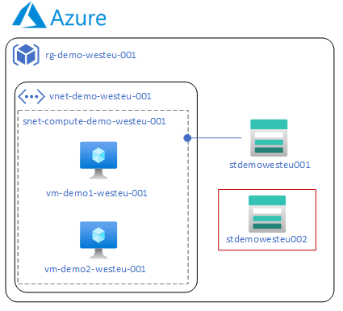

# GitOps-Demo

This repository contains the Terraform code and GitHub Actions configuration used in the Medium Article "[Deploying Cloud infrastructure, the GitOps way]()"

All the code is written in Terraform, and resources are deployed on Microsoft Azure.

## Project diagram
The following is the diagram representing all the elements deployed by the code defined within this repository.

Note: The red-rounded storage account is "optional" and is added/deleted to demonstrate the GitOps methodology fundamentals.

## Structure

The repository contains the main project files on environment folders:

DEV:

 - [main.tf](environments/dev/main.tf): Contains the module calls and provider configuration.
 - [variables.tf](environments/dev/variables.tf): Contains all relevant and necessary vars for all resources.
 - [outputs.tf](environments/dev/outputs.tf): Generic file to include outputs from modules/resources.

PROD:

 - [main.tf](environments/prod/main.tf): Contains the module calls and provider configuration.
 - [variables.tf](environments/prod/variables.tf): Contains all relevant and necessary vars for all resources.
 - [outputs.tf](environments/prod/outputs.tf): Generic file to include outputs from modules/resources.
 
 Then, at the "[modules](./modules/)" folder, are all the modules with resources defined on them. These modules can be reused and follows the following structure:
 
 - [network](./modules/network/README.md): Contains all necessary resources to deploy a VNet and a simple subnet inside this VNet.
 - [resource-group](./modules/resource-group/README.md): Contains a resource to create an Azure Resource Group.
 - [storage](./modules/storage/README.md): Defines a Storage Account, a container inside this account, and a private endpoint to the subnet defined in the network module.
 - [virtual-machines](./modules/virtual-machines/README.md): Contains all resources to deploy two Azure VM's, based on Ubuntu 22.04 LTS, their NIC's and connections to the subnet created in the network module.

## Environments

The operator will commit a change on a "Feature/X" branch. This push will trigger a Terraform Plan workflow for the DEV environment.

Once the TF Plan is reviewed, and the user agrees on the changes proposed by this workflow, then a Pull Request will be made to the "development" branch, which will execute the Terraform Apply workflow for the "DEV" environment.

If the changes of the DEV environment are correctly deployed, then we can open a new PR to add the new code to the "Main" branch, which will imply the execution of the Terraform Apply workflow for the PROD environment.

Aditionally, there're also a TF Plan workflow for the PROD environment, and both TF Destroy workflows for DEV and PROD. Both workflows can be manually executed at any time.

## GitHub Actions

All these resources are deployed using GitHub Actions, which configuration is specified in the "[.github](./.github/)" folder.

GitHub Actions uses private variables to handle sensible information such as those required by Terraform to interact with Azure.

The [.github](./.github/) folders contains a "[workflows](./.github/workflows)" subfolder which contains the following files:

- [apply_dev.yaml](./.github/workflows/apply_dev.yaml): This file, triggered when a Pull Request is merged into the development branch, specifies the GitHub Actions workflow to execute a Terraform apply command for the DEV environment, deploying the resources.
- [apply_prod.yaml](./.github/workflows/apply_dev.yaml): This file, triggered when a Pull Request is merged into the main branch, specifies the GitHub Actions workflow to execute a Terraform apply command for the PROD environment, deploying the resources.
- [plan_dev.yaml](./.github/workflows/plan_dev.yaml): This file, triggered when the user commits a change to a Feature/* branch, executes a Terraform plan for the DEV environment.
- [plan_prod.yaml](./.github/workflows/plan_prod.yaml): This file, manually triggered, executes a Terraform plan for the PROD environment.
- [destroy_dev.yaml](./.github/workflows/destroy_dev.yaml): This file, which can only be manually triggered, executes a Terraform destroy command for the DEV environment, deleting all the resources.
- [destroy_prod.yaml](./.github/workflows/destroy_prod.yaml): This file, which can only be manually triggered, executes a Terraform destroy command for the PROD environment, deleting all the resources.

The [assets](./assets) folder includes extra resources, such as Visio diagram files, exported PNG files for the diagrams, etc.

## Repository owner

This repository is created and maintained by [Alfonso Martínez García](https://github.com/alfmagar).